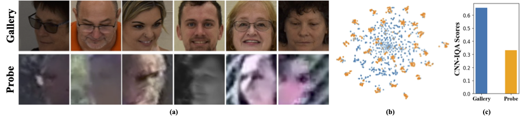

<div align="center">

# PETAL*face* : Parameter Efficient Transfer Learning <br> for Low-resolution Face Recognition
<h3><strong>WACV 2025</strong></h3>

[Kartik Narayan](https://kartik-3004.github.io/portfolio/)<sup>1</sup> &emsp; [Nithin Gopalakrishnan Nair](https://nithin-gk.github.io/)<sup>1</sup> &emsp; [Jennifer Xu](https://scholar.google.com/citations?hl=en&user=iFy2JdkAAAAJ&view_op=list_works&sortby=pubdate)<sup>2</sup> &emsp; [Rama Chellappa](https://engineering.jhu.edu/faculty/rama-chellappa/)<sup>1</sup> &emsp; [Vishal M. Patel](https://engineering.jhu.edu/faculty/vishal-patel/)<sup>1</sup>


Johns Hopkins University<sup>1</sup> &emsp; Systems and Technology Research<sup>2</sup>

<a href='https://kartik-3004.github.io/PETALface/'></a>
<a href='https://arxiv.org/abs/2412.07771'></a>
<a href='https://huggingface.co/kartiknarayan/PETALface'></a>

</div>
<hr />

## Motivation and Contribution

<p align="center" width="100%">
  
</p>
Figure 1. (a) An illustration of the gallery and probe images from low-resolution dataset (BRIAR). Gallery images usually are high quality compared to the probe images. (b) t-SNE plot for the gallery and probe images of the BRIAR dataset. (c) Average CNN-IQA scores of gallery and probe images for 50 identities of the BRIAR dataset.

<p align="center" width="100%">
  
</p>
Figure 2. The proposed PETAL<i>face</i>: a parameter efficient transfer learning approach adapts to low-resolution datasets beating the performance of pre-trained models with negligible drop in performance on high-resolution and mixed-quality datasets. PETAL<i>face</i> enables development of generalized models achieving competitive performance on high-resolution (LFW, CFP-FP, CPLFW, AgeDB, CALFW, CFP-FF) and mixed-quality datasets (IJB-B, IJB-C) with big enhancements in low-quality datasets (TinyFace, BRIAR, IJB-S).
<br><br>


Low-resolution datasets contain images with poor clarity, making it challenging to extract meaningful discriminative features essential for face recognition and verification. Moreover, low-resolution datasets are usually small, with a limited number of subjects, as curating them requires significant time, effort, and investment. Existing methods force the learning of high-resolution and low-resolution face images in a single encoder, failing to account for the domain differences between them. From Figure 1(a), 1(b), and 1(c), we observe that high-quality gallery images and low-quality probe images belong to distinct domains, and require separate encoders to extract meaningful features for classification. A naive approach to adapting pre-trained models to low-resolution datasets is supervised full fine-tuning on these datasets. However, as mentioned, low-resolution datasets are small in size, and updating a model with a large number of parameters on a small low-resolution dataset results in poor convergence. This makes the model prone to catastrophic forgetting and we see a drop in performance on high-resolution and mixed-quality datasets, as shown in Figure 2. 


With the above motivation,<br>
1️⃣ We introduce the use of the LoRA-based PETL technique to adapt large pre-trained face-recognition models to low-resolution datasets.<br>
2️⃣ We propose an image-quality-based weighting of LoRA modules to create separate proxy encoders for high-resolution and low-resolution data, ensuring effective extraction of embeddings for face recognition.<br>
3️⃣ We demonstrate the superiority of PETAL<i>face</i> in adapting to low-resolution datasets, outperforming other state-of-the-art models on low-resolution benchmarks while maintaining performance on high-resolution and mixed-quality datasets.<br>

> **<p align="justify"> Abstract:** *Pre-training on large-scale datasets and utilizing margin-based loss functions have
> been highly successful in training models for high-resolution face recognition. However, these models struggle with
> low-resolution face datasets, in which the faces lack the facial attributes necessary for distinguishing different faces.
> Full fine-tuning on low-resolution datasets, a naive method for adapting the model, yields inferior performance due to
> catastrophic forgetting of pre-trained knowledge. Additionally the domain difference between high-resolution (HR) gallery
> images and low-resolution (LR) probe images in low resolution datasets leads to poor convergence for a single model to
> adapt to both gallery and probe after fine-tuning. To this end, we propose PETALface, a Parameter-Efficient
> Transfer Learning approach for low-resolution face recognition. Through PETALface, we attempt to solve both the
> aforementioned problems. (1) We solve catastrophic forgetting by leveraging the power of parameter efficient fine-tuning(PEFT).
> (2) We introduce two low-rank adaptation modules to the backbone, with weights adjusted based on the input image quality
> to account for the difference in quality for the gallery and probe images. To the best of our knowledge, PETALface is the
> first work leveraging the powers of PEFT for low resolution face recognition. Extensive experiments demonstrate that the
> proposed method outperforms full fine-tuning on low-resolution datasets while preserving performance on high-resolution and
> mixed-quality datasets, all while using only 0.48% of the parameters.* </p>

# Framework
<p align="center" width="100%">
  
</p>
Overview of the proposed PETAL<i>face</i> approach: We include an additional trainable module in linear layers present in attention layers and the final feature projection MLP. The trainable module is highlighted on the right. Specifically, we add two LoRA layers, where the weightage α is decided based on the input-image quality, computed using an off-the-shelf image quality assessment network (IQA).

# :rocket: News
- [12/09/2025] 🔥 We release PETAL*face*.

# Installation
```bash
conda env create --file environment.yml
conda activate petalface
```

# Download Data
The datasets can be downloaded from their respective webpages or by mailing the authors:<br>
1. [WebFace4M, WebFace12M](https://www.face-benchmark.org/)<br>
2. [TinyFace](https://qmul-tinyface.github.io/)<br>
3. [BRIAR](https://openaccess.thecvf.com/content/WACV2023W/LRR/papers/Cornett_Expanding_Accurate_Person_Recognition_to_New_Altitudes_and_Ranges_The_WACVW_2023_paper.pdf)<br>
4. [IJB-S](https://biometrics.cse.msu.edu/Publications/Face/Kalkaetal_IJBSIARPPAJanusSurveillanceVideoBenchmark_BTAS2018.pdf)<br>
5. [IJB-B, IJB-C](https://github.com/deepinsight/insightface/tree/master/recognition/_evaluation_/ijb)<br>
6. [LFW](https://drive.google.com/file/d/1iGYoCyhpq-Pi9Trpe7wrDs_J88Prz8ck/view?usp=sharing)<br>
7. [CFP-FP](https://drive.google.com/file/d/1lhDVa0QG3yWkWOgPIUZePQRsxvf274YG/view?usp=sharing)<br>
8. [CPLFW](https://drive.google.com/file/d/1MSA_grs6JAlyNQ3v7Dulc1URfupQZiJ3/view?usp=sharing)<br>
9. [AgeDB-30](https://drive.google.com/file/d/1HwIyBR429B7aOsghST59Styr3K90O2Ek/view?usp=sharing)<br>
10. [CALFW](https://drive.google.com/file/d/1_xAoOaAjVXhaG5JfzzXnZyQHrB81X0zS/view?usp=sharing)<br>
11. [CFP-FF](https://drive.google.com/file/d/1HnQf1sfzxEhk2QItsXAXsgV3TXBbElIS/view?usp=sharing)<br>

Arrange the dataset in the following manner:
```python
data/
├── BRIAR/
│   ├── train_set_1/
│   │   ├── train.idx
│   │   ├── train.lst
│   │   └── train.rec
│   └── train_set_2/
│       ├── train.idx
│       ├── train.lst
│       └── train.rec
├── HQ_val/
│   ├── agedb_30.bin
│   ├── calfw.bin
│   ├── cfp_ff.bin
│   ├── cfp_fp.bin
│   ├── cplfw.bin
│   └── lfw.bin
├── ijb/
│   ├── IJB_11.py
│   ├── IJBB/
│   ├── IJBC/
│   ├── recognition/
│   └── run.sh
├── IJBS/
│   ├── ijbs_participant_publication_consent.csv
│   ├── img/
│   ├── img.md5
│   ├── protocols/
│   ├── README.pdf
│   ├── videos/
│   ├── videos.md5
│   ├── videos_ground_truth/
│   └── videos_ground_truth.md5
├── tinyface_aligned_112/
│   ├── Gallery_Distractor/
│   ├── Gallery_Match/
│   ├── Probe/
│   ├── train.idx
│   ├── train.lst
│   └── train.rec
├── WebFace12M/
│   ├── train.idx
│   ├── train.lst
│   └── train.rec
└── WebFace4M/
    ├── train.idx
    ├── train.lst
    └── train.rec
```

# Download Model weights
The pre-traind model can be downloaded manually from [HuggingFace](https://huggingface.co/kartiknarayan/petalface) or using python:
```python
from huggingface_hub import hf_hub_download

# Finetuned Weights

# The filename "swin_arcface_webface4m_tinyface" indicates that the model has a swin bakcbone and pretraind
# on webface4m dataset with arcface loss function and finetuned on tinyface.
hf_hub_download(repo_id="kartiknarayan/PETALface", filename="swin_arcface_webface4m_tinyface/model.pt", local_dir="./weights")
hf_hub_download(repo_id="kartiknarayan/PETALface", filename="swin_cosface_webface4m_tinyface/model.pt", local_dir="./weights")
hf_hub_download(repo_id="kartiknarayan/PETALface", filename="swin_cosface_webface4m_briar/model.pt", local_dir="./weights")
hf_hub_download(repo_id="kartiknarayan/PETALface", filename="swin_cosface_webface12m_briar/model.pt", local_dir="./weights")

# Pre-trained Weights
hf_hub_download(repo_id="kartiknarayan/PETALface", filename="swin_arcface_webface4m/model.pt", local_dir="./weights")
hf_hub_download(repo_id="kartiknarayan/PETALface", filename="swin_cosface_webface4m/model.pt", local_dir="./weights")
hf_hub_download(repo_id="kartiknarayan/PETALface", filename="swin_arcface_webface12m/model.pt", local_dir="./weights")
hf_hub_download(repo_id="kartiknarayan/PETALface", filename="swin_cosface_webface12m/model.pt", local_dir="./weights")
```

# Usage
Download the trained weights from [HuggingFace](https://huggingface.co/kartiknarayan/petalface) and ensure the data is downloaded with appropriate directory structure.<br>

### Training
```python
### BRISQUE | CosFace | TinyFace ###
NCCL_P2P_DISABLE=1 CUDA_VISIBLE_DEVICES=0,1,2,3,4,5,6,7 torchrun --nproc_per_node=8 --master_port=29190 train_iqa.py \
    --network swin_256new_iqa \
    --head partial_fc \
    --output /mnt/store/knaraya4/PETALface/<model_save_folder> \
    --margin_list 1.0,0.0,0.4 \
    --batch-size 8 \
    --optimizer adamw \
    --weight_decay 0.1 \
    --rec /data/knaraya4/data/<folder_to_rec_file> \
    --num_classes 2570 \
    --num_image 7804 \
    --num_epoch 50 \
    --lr 0.0005 \
    --fp16 \
    --warmup_epoch 2 \
    --image_size 120 \
    --use_lora \
    --lora_rank 8 \
    --iqa brisque \
    --threshold <threshold> \
    --seed 19 \
    --load_pretrained /mnt/store/knaraya4/PETALface/<path_to_pretrained_model>

###
# For CosFace, --margin_list 1.0,0.0,0.4; For ArcFace, --margin_list 1.0,0.5,0.0
# For BRISQUE, --iqa brisque; For CNNIQA, --iqa cnniqa; set the threshold accordingly
# For TinyFace,
#   --num_classes 2570
#   --num_image 7804
#   --num_epoch 40
#   --warmup_epoch 2
# For BRIAR,
#   --num_classes 778
#   --num_image 301000
#   --num_epoch 10
#   --warmup_epoch 1
###
```
The trained models are stored in the specified "ouptut".<br>
<b>NOTE</b>: The training scripts for pretraining and LoRA finetuning are provided in [PETALface/scripts](scripts).

### Inference
```python
# Validation HQ dataset
CUDA_VISIBLE_DEVICES=0 python validation_hq/validate_hq_iqa.py \
    --model_load_path /mnt/store/knaraya4/PETALface/<folder_name>/model.pt \
    --data_root /data/knaraya4/data/<hq_dataset_folder> \
    --model_type swin_256new_iqa  \
    --image_size 120 \
    --lora_rank 8 \
    --use_lora \
    --iqa cnniqa \
    --threshold threshold

# Validation Mixed Quality Dataset | IJBC
CUDA_VISIBLE_DEVICES=0 python validation_ijb/eval_ijb_iqa.py \
    --model_load_path /mnt/store/knaraya4/PETALface/<folder_name>/model.pt \
    --data_root /data/knaraya4/data/ijb/<ijbc_dataset_folder> \
    --batch-size 1024 \
    --model_type swin_256new_iqa \
    --target IJBC \
    --image_size 120 \
    --lora_rank 8 \
    --use_lora \
    --iqa cnniqa \
    --threshold <threshold>

# Validation Mixed Quality Dataset | IJBB
CUDA_VISIBLE_DEVICES=0 python validation_ijb/eval_ijb_iqa.py \
    --model_load_path /mnt/store/knaraya4/PETALface/<folder_name>/model.pt \
    --data_root /data/knaraya4/data/<ijbb_dataset_folder> \
    --batch-size 1024 \
    --model_type swin_256new_iqa \
    --target IJBB \
    --image_size 120 \
    --lora_rank 8 \
    --use_lora \
    --iqa cnniqa \
    --threshold <threshold>

# Validation Low-quality Dataset | TinyFace
CUDA_VISIBLE_DEVICES=0 python validation_lq/validate_tinyface_iqa.py \
    --data_root /data/knaraya4/data \
    --batch_size 512 \
    --model_load_path /mnt/store/knaraya4/PETALface/<folder_name>/model.pt \
    --model_type swin_256new_iqa \
    --image_size 120 \
    --lora_rank 8 \
    --use_lora \
    --iqa cnniqa \
    --threshold <threshold>

# Validation Low-quality Dataset | IJBS
CUDA_VISIBLE_DEVICES=0 python validation_lq/validate_ijbs_iqa.py \
    --data_root /mnt/store/knaraya4/data/<ijbs_dataset_folder> \
    --batch_size 2048 \
    --model_load_path /mnt/store/knaraya4/PETALface/<folder_name>/model.pt \
    --model_type swin_256new_iqa \
    --image_size 120 \
    --lora_rank 8 \
    --use_lora \
    --iqa cnniqa \
    --threshold <threshold>

```
<b>NOTE</b>: The inference scripts are provided in [PETALface/scripts](scripts).

## Citation
If you find PETAL*face* useful for your research, please consider citing us:

```bibtex
@article{narayan2024petalface,
  title={PETALface: Parameter Efficient Transfer Learning for Low-resolution Face Recognition},
  author={Narayan, Kartik and Nair, Nithin Gopalakrishnan and Xu, Jennifer and Chellappa, Rama and Patel, Vishal M},
  journal={arXiv preprint arXiv:2412.07771},
  year={2024}
}
```

## Contact
If you have any questions, please create an issue on this repository or contact at knaraya4@jhu.edu
