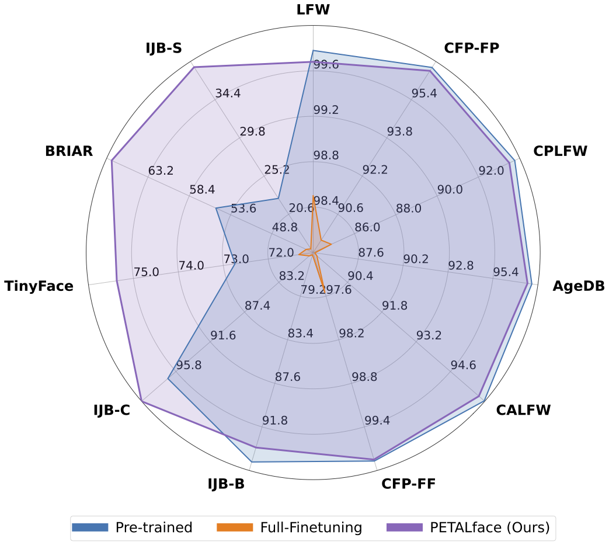

<div align="center">

# PETAL*face* : Parameter Efficient Transfer Learning <br> for Low-resolution Face Recognition
<h3><strong>WACV 2025</strong></h3>

[Kartik Narayan](https://kartik-3004.github.io/portfolio/)<sup>1</sup> &emsp; [Nithin Gopalakrishnan Nair](https://nithin-gk.github.io/)<sup>1</sup> &emsp; [Jennifer Xu](https://scholar.google.com/citations?hl=en&user=iFy2JdkAAAAJ&view_op=list_works&sortby=pubdate)<sup>2</sup> &emsp; [Rama Chellappa](https://engineering.jhu.edu/faculty/rama-chellappa/)<sup>1</sup> &emsp; [Vishal M. Patel](https://engineering.jhu.edu/faculty/vishal-patel/)<sup>1</sup>


Johns Hopkins University<sup>1</sup> &emsp; Systems and Technology Research<sup>2</sup>

<a href='https://kartik-3004.github.io/PETALface/'></a>
<a href='[https://arxiv.org/pdf/2404.14406.pdf](https://kartik-3004.github.io/PETALface/)'></a>
<a href='https://huggingface.co/kartiknarayan/PETALface'></a>

</div>
<hr />

## Motivation and Contribution

<p align="center" width="100%">
  
</p>
Figure 1. (a) An illustration of the gallery and probe images from low-resolution dataset (BRIAR). Gallery images usually are high quality compared to the probe images. (b) t-SNE plot for the gallery and probe images of the BRIAR dataset. (c) Average CNN-IQA scores of gallery and probe images for 50 identities of the BRIAR dataset.

<p align="center" width="100%">
  
</p>
Figure 2. The proposed PETALface: a parameter efficient transfer learning approach adapts to low-resolution datasets beating the performance of pre-trained models with negligible drop in performance on high-resolution and mixed-quality datasets. PETALface enables development of generalized models achieving competitive performance on high-resolution (LFW, CFP-FP, CPLFW, AgeDB, CALFW, CFP-FF) and mixed-quality datasets (IJB-B, IJB-C) with big enhancements in low-quality surveillance quality datasets (TinyFace, BRIAR, IJB-S)
<br><br>


Low-resolution datasets contain images with poor clarity, making it challenging to extract meaningful discriminative features essential for face recognition and verification. Moreover, low-resolution datasets are usually small, with a limited number of subjects, as curating them requires significant time, effort, and investment. Existing methods force the learning of high-resolution and low-resolution face images in a single encoder, failing to account for the domain differences between them. From Figure 1(a), 1(b), and 1(c), we observe that high-quality gallery images and low-quality probe images belong to distinct domains, and require separate encoders to extract meaningful features for classification. A naive approach to adapting pre-trained models to low-resolution datasets is supervised full fine-tuning on these datasets. However, as mentioned, low-resolution datasets are small in size, and updating a model with a large number of parameters on a small low-resolution dataset results in poor convergence. This makes the model prone to catastrophic forgetting and we see a drop in performance on high-resolution and mixed-quality datasets, as shown in Figure 2. 


With the above motivation,
1️⃣ We introduce the use of the LoRA-based PETL technique to adapt large pre-trained face-recognition models to low-resolution datasets.<br>
2️⃣ We propose an image-quality-based weighting of LoRA modules to create separate proxy encoders for high-resolution and low-resolution data, ensuring effective extraction of embeddings for face recognition.<br>
3️⃣ We demonstrate the superiority of PETALface in adapting to low-resolution datasets, outperforming other state-of-the-art models on low-resolution benchmarks while maintaining performance on high-resolution and mixed-quality datasets.<br>

> **<p align="justify"> Abstract:** *Pre-training on large-scale datasets and utilizing margin-based loss functions have
> been highly successful in training models for high-resolution face recognition. However, these models struggle with
> low-resolution face datasets, in which the faces lack the facial attributes necessary for distinguishing different faces.
> Full fine-tuning on low-resolution datasets, a naive method for adapting the model, yields inferior performance due to
> catastrophic forgetting of pre-trained knowledge. Additionally the domain difference between high-resolution (HR) gallery
> images and low-resolution (LR) probe images in low resolution datasets leads to poor convergence for a single model to
> adapt to both gallery and probe after fine-tuning. To this end, we propose PETALface, a Parameter-Efficient
> Transfer Learning approach for low-resolution face recognition. Through PETALface, we attempt to solve both the
> aforementioned problems. (1) We solve catastrophic forgetting by leveraging the power of parameter efficient fine-tuning(PEFT).
> (2) We introduce two low-rank adaptation modules to the backbone, with weights adjusted based on the input image quality
> to account for the difference in quality for the gallery and probe images. To the best of our knowledge, PETALface is the
> first work leveraging the powers of PEFT for low resolution face recognition. Extensive experiments demonstrate that the
> proposed method outperforms full fine-tuning on low-resolution datasets while preserving performance on high-resolution and
> mixed-quality datasets, all while using only 0.48% of the parameters.* </p>

# Framework
<p align="center" width="100%">
  
</p>
Overview of the proposed PETALface approach: We include an additional trainable module in linear layers present in attention layers and the final feature projection MLP. The trainable module is highlighted on the right. Specifically, we add two LoRA layers, where the weightage α is decided based on the input-image quality, computed using an off-the-shelf image quality assessment network (IQA).

# :rocket: News
- [12/09/2025] 🔥 We release PETAL*face*.

# Installation
```bash
conda env create --file environment.yml
conda activate petalface
```

# Download Data
The datasets can be downloaded from their respective webpages or by mailing the authors:<br>
1. [Idiap Replay Attack](https://www.idiap.ch/en/scientific-research/data/replayattack)<br>
2. [MSU MFSD](https://sites.google.com/site/huhanhomepage/datasetcode)<br>
3. [CASIA MFSD](https://ieeexplore.ieee.org/document/6199754)<br>
4. [OULU-NPU](https://sites.google.com/site/oulunpudatabase/)<br>
5. [ROSEYoutu](https://rose1.ntu.edu.sg/dataset/faceLivenessDetection/)<br>

Arrange the dataset in the following manner:
```python
.
├── datasets
│   ├── ReplayAttack
│   │   ├── train_frames
│   │   ├── test_frames
│   │   ├── devel_frames
│   ├── MSU MFSD
│   │   ├── train
│   │   ├── test
│   ├── CASIA MFSD
│   │   ├── train
│   │   ├── test
│   ├── OULU_NPU
│   │   ├── Train_frames
│   │   ├── Test_frames
│   │   ├── Dev_frames
│   │   ├── Protocols
│   ├── ROSEYoutu
│   │   ├── client
│   │   │   ├── rgb
│   │   │   │   ├── adaptation
│   │   │   │   ├── test
```
NOTE: The train, test and eval splits are provided in the /data/ folder.

# Download Pre-trained weights
The pre-traind model can be downloaded manually from [HuggingFace](https://huggingface.co/kartiknarayan/petalface) or using python:
```python
from huggingface_hub import hf_hub_download

hf_hub_download(repo_id="kartiknarayan/petalface", filename="pretrained_weights/vgg_face_dag.pth", local_dir="./")
```
The directory structure should finally be:

```
  . ── hyp-oc ──┌── pretrained_weights/vgg_face_dag.pth
                ├── data
                ├── hyptorch
                ├── config.py
                ├── dataloader.py
                ├── loss.py
                ├── models.py
                ├── statistics.py
                ├── train.py
                ├── test.py
                └── utils.py                    
```

# Usage
Download the pre-trained weights from [HuggingFace](https://huggingface.co/kartiknarayan/petalface) and ensure the directory structure is correct.<br>

### Training
```python
  python train.py \
      --expt_name roseyoutu \
      --dataset ROSEYoutu \
      --device 0 \
      --epochs 60 \
      --batch_size_train 8 \
      --batch_size_val 128 \
      --val_check_after_epoch 1 \
      --save_for_each_val_epoch True \
      --optim_lr 1e-6 \
      --optim_weight_decay 1e-6 \
      --std_dev 1 \
      --feature_dimension 4096 \
      --alpha 0.8 \
      --curvature 0.1

# -- dataset = [ROSEYoutu, ReplayAttack, CASIA_MFSD, MSU_MFSD, OULU_NPU, OCI, OMI, OCM, ICM]
```
The trained models are stored in the specified "save_root".<br>
The training logs can be seen at "log_root"

### Inference
```python
python test.py \
    --source_dataset ReplayAttack \
    --target_dataset MSU_MFSD \
    --device 0 \
    --curvature 0.1 \
    --batch_size_test 32 \
    --list replayattack
```
--list contains "," separated experiment names performed on the --source_dataset.

## Citation
If you find PETAL*face* useful for your research, please consider citing us:

```bibtex
Coming Soon !!!
```

## Contact
If you have any questions, please create an issue on this repository or contact at knaraya4@jhu.edu
